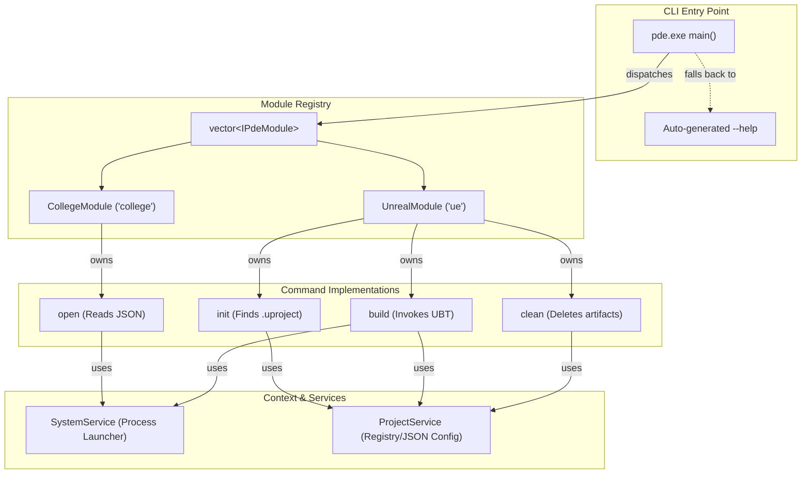

<div align="center">
  
# PDE (Personal Development Environment) Core

**A high-performance, project-aware, extensible CLI tool for automating development workflows across multiple tech stacks.**


</div>

---

## 🌟 Vision & Philosophy

The **PDE Core** was built to eliminate boilerplate from daily software engineering life. It functions as a **God-level dispatcher**, instantly orchestrating complex local development setups with zero mental overhead. 

Whether you are spinning up a multi-container C# backend, connecting a Java frontend to XAMPP, or executing deep Unreal Engine build sequences, PDE acts as your command center.

It is inspired by tools like `git` and `ue4cli`—it is **project-aware** (maintaining a `.pde/` context directory) and strictly follows the **Command Design Pattern** for infinite modular extensibility.

---

## 🏗️ Architecture Diagram

The system is built on a highly modular, interface-driven C++17 architecture. It uses a **Two-Level Dispatcher** (`main()` → `IPdeModule` → `ICommand`) allowing new tech stacks to be plugged in trivially.



---

## 🚀 Features & Modules

### 1. `college` Module (Universal Stack Orchestrator)
Parses a `config/college.json` database to instantly launch complex, multi-application environments.
* **Usage:** `pde college open <stack_name>` (or simply `open <stack_name>`)
* **Example Stacks:** `ajava` (Eclipse + XAMPP + phpMyAdmin), `cs` (Visual Studio C# + DB), `wordpress`.

### 2. `ue` Module (Project-Aware Unreal Engine CLI)
Maintains local context via a `.pde/project.json` file, auto-detects engine paths via the Windows Registry, and manages build artifacts.
* **`pde ue init`**: Scans the current directory for a `.uproject` file, queries the Windows Registry (32-bit and 64-bit views) to locate the Unreal Engine installation, and saves a portable configuration.
* **`pde ue build`**: Automatically invokes UnrealBuildTool (UBT) for the current project.
* **`pde ue clean [--dry-run]`**: Safely wipes `Binaries/`, `Intermediate/`, `Saved/`, and `DerivedDataCache/` to fix corrupted builds.

---

## 🛠️ Installation & Setup

Because PDE interacts deeply with Windows processes and the Registry, it is built specifically for Windows using **MSVC**.

### Step 1: Clone the Repository
```powershell
git clone https://github.com/Jaiminsinh-Dodiya/Personal-Development-Environment.git
cd Personal-Development-Environment
```

### Step 2: Build the Core
The project includes an intelligent PowerShell build script (`build.ps1`). It automatically locates your Visual Studio 2022 installation, bootstraps the MSVC `x64` environment, and compiles the source code into `bin/pde_core.exe`.

> **Important:** The script expects Visual Studio 2022 to be installed at `D:\Software\Visual Studio 2022`. If your installation is on `C:\` or located elsewhere, you will need to open `build.ps1` and modify the `-Path` argument on line 12.

```powershell
# Run from any standard PowerShell window
.\build.ps1
```
Upon success, you should see `Build successful: bin\pde_core.exe` and 0 errors.

### Step 3: Shell Integration (PowerShell Profile)
To make the `pde` command globally available, you need to add it to your PowerShell profile.

1. Open your PowerShell profile in Notepad:
   ```powershell
   notepad $PROFILE
   ```
   *(If it says the file doesn't exist, create it first by running: `New-Item -Type File -Force $PROFILE`)*

2. Copy the contents of the `Microsoft.PowerShell_profile.ps1` file from this repository and paste it into your profile.
3. Restart your PowerShell window.

You can now use `pde --help` from anywhere on your PC!

---

## ⚙️ Configuration

### College JSON Template
If you are using the `college` module, you must set up your tech stacks. 
1. Copy `config/college.json.example` to `config/college.json`.
2. Edit the file to reflect the absolute paths of your IDEs and XAMPP/server installations on your local machine.

### Unreal Engine Detection
The `ue` module requires zero manual path configuration! It automatically queries:
`HKLM\SOFTWARE\EpicGames\Unreal Engine\<version>\InstalledDirectory`
If Epic Games changes its registry mapping in the future, it will fall back to asking you for the path interactively.

---

## 🔮 Future Vision

This architecture was specifically designed for **Horizontal Scaling**. Moving forward, the goal is to add:
1. **`git` Module**: High-level macros for branch cleaning, bulk stash popping, and standardized commit linting.
2. **`docker` Module**: Abstracting `docker-compose` tear-downs and volume pruning into one-word commands.
3. **Daemon/Background Mode**: A system tray worker that monitors Unreal Engine crash logs in real-time and auto-cleans the `DerivedDataCache`.

---
*Architected and developed by Jaimin — automating the boring stuff so we can focus on building the cool stuff.*
