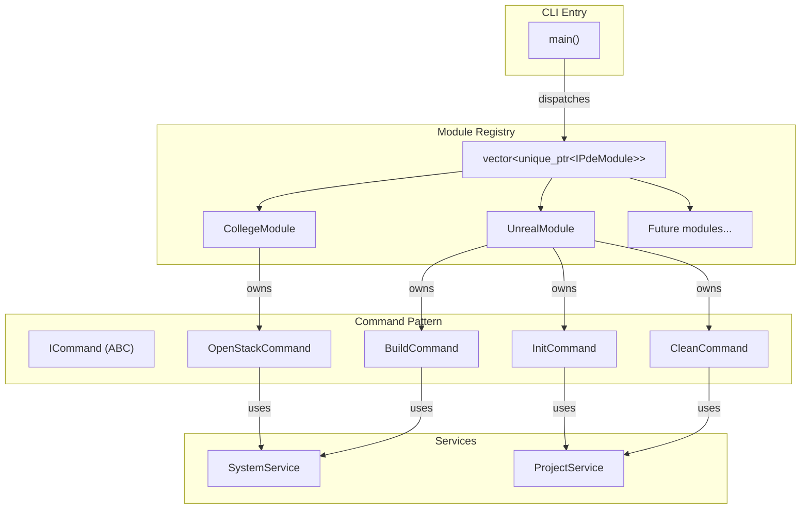

# PDE Core → Project-Aware Extensible CLI

Transform the single-file [pde_core.cpp](file:///d:/PDE/src/pde_core.cpp) into a multi-file, **interface-based plugin architecture** with a **command pattern**, making it a project-aware CLI (like `git` or `ue4cli`).

## Design Decisions (Approved)

- **Build system:** `build.ps1` using `cl.exe` — ideal for Windows-specific project
- **UE detection:** `pde ue init` auto-detects engine path from Windows Registry (`HKLM\SOFTWARE\EpicGames\Unreal Engine`), falls back to interactive prompt if not found
- **Portability:** `.pde/project.json` stores **relative paths only** — safe to share across machines with different drive letters

---

## Phased Rollout

Each phase is a working, shippable state. We commit + push after each.

| Phase | Name | What Changes | Git Message |
|-------|------|-------------|-------------|
| **1** | The Split | Multi-file layout, `build.ps1`, `ICommand`, two-level dispatcher | `feat: multi-file plugin architecture` |
| **2** | The Brain | `ProjectService`, `.pde/` folder, UE registry detection | `feat: project-aware context service` |
| **3** | The Unreal Module | `pde ue init/build/clean`, dry-run support | `feat: Unreal Engine module` |
| **4** | The Polish | Auto-generated `--help`, PowerShell profile update | `feat: help system + shell integration` |

---

## Architecture Overview



---

## Proposed Changes

### 1. New File Layout

The single [pde_core.cpp](file:///d:/PDE/src/pde_core.cpp) splits into headers + sources, grouped by responsibility:

```
d:\PDE\
├── src/
│   ├── main.cpp                  # Entry point + module registry
│   ├── core/
│   │   ├── colors.h              # Color namespace (header-only)
│   │   ├── ipde_module.h         # IPdeModule ABC
│   │   ├── icommand.h            # ICommand ABC + DryRun support
│   │   └── system_service.h/.cpp # SystemService class
│   ├── services/
│   │   └── project_service.h/.cpp # .pde/ folder discovery & management
│   └── modules/
│       ├── college/
│       │   ├── college_module.h/.cpp
│       │   └── open_stack_command.h/.cpp
│       └── unreal/
│           ├── unreal_module.h/.cpp
│           ├── init_command.h/.cpp
│           ├── build_command.h/.cpp
│           └── clean_command.h/.cpp
├── config/
│   ├── college.json
│   └── college.json.example
├── includes/nlohmann/json.hpp
├── build.ps1                      # [NEW] Build script
└── Microsoft.PowerShell_profile.ps1
```

---

### 2. Core Interfaces

#### [NEW] [icommand.h](file:///d:/PDE/src/core/icommand.h)

The **Command Pattern** base class. Every action (`open`, `init`, `build`, `clean`) becomes a command object.

```cpp
class ICommand {
public:
    virtual ~ICommand() = default;
    virtual std::string GetName() const = 0;        // e.g. "build"
    virtual std::string GetHelp() const = 0;        // one-line description
    virtual void Execute(const std::vector<std::string>& args, bool dryRun = false) const = 0;
};
```

- `dryRun` flag: when `true`, commands print what they *would* do without actually doing it — enables a future `pde --dry-run build` mode.

#### [MODIFY] [ipde_module.h](file:///d:/PDE/src/core/ipde_module.h)

Updated interface — modules now **own a vector of commands** instead of handling everything in one method:

```cpp
class IPdeModule {
public:
    virtual ~IPdeModule() = default;
    virtual std::string GetName() const = 0;              // "college", "unreal"
    virtual std::string GetDescription() const = 0;       // shown in help
    virtual const std::vector<std::unique_ptr<ICommand>>& GetCommands() const = 0;
};
```

Dispatch flow: [main](file:///d:/PDE/src/pde_core.cpp#141-170) finds the module → module finds the command → command executes.

---

### 3. Services

#### [MODIFY] [system_service.h/.cpp](file:///d:/PDE/src/core/system_service.h)

Extracted from [pde_core.cpp](file:///d:/PDE/src/pde_core.cpp) — no logic change, just moved to its own file.

#### [NEW] [project_service.h/.cpp](file:///d:/PDE/src/services/project_service.h)

Handles **project-awareness** (the `git init` analogy):

```cpp
namespace ProjectService {
    // Scan CWD for .uproject files
    std::optional<std::filesystem::path> FindUProject();

    // Auto-detect UE install from Windows Registry
    // Reads HKLM\SOFTWARE\EpicGames\Unreal Engine\<version>\InstalledDirectory
    std::optional<std::filesystem::path> DetectEngineFromRegistry();

    // Read/write .pde/project.json
    std::optional<json> LoadProjectConfig();
    bool SaveProjectConfig(const json& config);

    // Project path constants
    constexpr auto PDE_DIR = ".pde";
    constexpr auto PROJECT_FILE = "project.json";
}
```

A `.pde/project.json` uses **relative paths** for portability:

```json
{
  "engine_version": "5.3",
  "project_name": "MyGame",
  "project_file": "MyGame.uproject"
}
```

> [!NOTE]
> The engine install path is resolved at runtime via registry lookup, never stored in the config. Only the **version string** is saved so the correct registry key can be queried on any machine.

---

### 4. College Module (Refactored)

#### [NEW] [college_module.h/.cpp](file:///d:/PDE/src/modules/college/college_module.h)

- [GetName()](file:///d:/PDE/src/pde_core.cpp#78-79) → `"college"`
- `GetCommands()` → returns vector containing `OpenStackCommand`

#### [NEW] [open_stack_command.h/.cpp](file:///d:/PDE/src/modules/college/open_stack_command.h)

Extracted from the old `CollegeModule::HandleCommand`. Command name: `open` (default). Usage: `pde college ajava`.

---

### 5. Unreal Module (New)

#### [NEW] [unreal_module.h/.cpp](file:///d:/PDE/src/modules/unreal/unreal_module.h)

- [GetName()](file:///d:/PDE/src/pde_core.cpp#78-79) → `"ue"` (short and memorable)
- `GetCommands()` → `InitCommand`, `BuildCommand`, `CleanCommand`

#### [NEW] [init_command.h/.cpp](file:///d:/PDE/src/modules/unreal/init_command.h)

`pde ue init` — scans CWD for `.uproject`, queries the Windows Registry for the engine path, and creates `.pde/project.json`. If registry lookup fails, prompts the user interactively.

#### [NEW] [build_command.h/.cpp](file:///d:/PDE/src/modules/unreal/build_command.h)

`pde ue build` — reads `.pde/project.json`, invokes `UnrealBuildTool` via [SystemService](file:///d:/PDE/src/pde_core.cpp#30-54).

#### [NEW] [clean_command.h/.cpp](file:///d:/PDE/src/modules/unreal/clean_command.h)

`pde ue clean` — deletes `Binaries/`, `Intermediate/`, `Saved/`, `DerivedDataCache/` folders. Perfect `dryRun` candidate.

---

### 6. Main Dispatcher

#### [MODIFY] [main.cpp](file:///d:/PDE/src/main.cpp)

The [main](file:///d:/PDE/src/pde_core.cpp#141-170) function becomes a **two-level dispatcher**: module → command.

```cpp
int main(int argc, char* argv[]) {
    enableAnsiColors();

    // Registry
    std::vector<std::unique_ptr<IPdeModule>> modules;
    modules.push_back(std::make_unique<CollegeModule>());
    modules.push_back(std::make_unique<UnrealModule>());

    if (argc < 2) { printHelp(modules); return 0; }

    std::string moduleName = argv[1];
    // Find module → find command → execute
}
```

The `printHelp()` function auto-generates help text by iterating all modules and their commands — **zero maintenance**.

---

### 7. Build Script

#### [NEW] [build.ps1](file:///d:/PDE/build.ps1)

Replaces the single-file compile with a multi-source build:

```powershell
$sources = Get-ChildItem -Path "src" -Recurse -Filter "*.cpp"
cl /EHsc /std:c++17 /I"includes" $sources.FullName /Fe:"bin\pde_core.exe"
```

---

### 8. PowerShell Profile Update

#### [MODIFY] [Microsoft.PowerShell_profile.ps1](file:///d:/PDE/Microsoft.PowerShell_profile.ps1)

Update the `open` function to support the new two-level CLI, and add an alias `pde` for direct access:

```powershell
function pde {
    & "D:\PDE\bin\pde_core.exe" @args
}
# Keep `open` as a shortcut for backward compat
function open { pde college @args }
```

---

## Verification Plan

### Build Verification
1. Run `.\build.ps1` from `d:\PDE` — should compile with zero errors/warnings
2. Confirm `bin\pde_core.exe` is produced

### Backward Compatibility
1. Run `pde college ajava` — should behave identically to current behavior (launch Eclipse, MySQL, phpMyAdmin)
2. Run `pde college cs` — should open the C# workspace
3. Run `pde` with no args — should show auto-generated help listing all modules and commands

### New Commands (Manual — requires an Unreal project folder)
1. `cd` into a folder containing a `.uproject` file
2. Run `pde ue init` — should create `.pde/project.json`
3. Run `pde ue clean --dry-run` — should **print** which folders it would delete without deleting them
4. Run `pde ue clean` — should delete `Binaries/`, `Intermediate/`, etc.

> [!NOTE]
> There are no existing automated tests in the project. If you'd like, I can also add a simple test harness as part of this plan — let me know.
